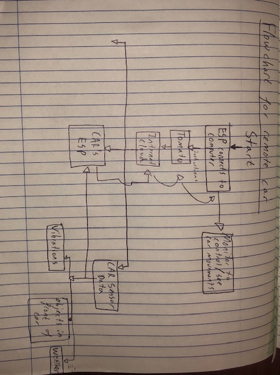

#  Skill Name

Author: Timin Kanani

Date: 2022-04-06
-----

## Summary
In this skill I thought about what would be needed in a system where you were able to remotely control a car from your esp32 with a monitor and transmit that to an esp32 in the car. The car would then measure sensor data and send it back to the esp32 through the cloud and local network

## ways in which the system could be infiltrated
1)you could have a freeloader, someone could connect to the local network and use up a lot of our bandwidth which would interupt the system and could be dangerous if the car were no longer able to be controlled
2)Someone could get access to the car and replace the esp32 on the car with their own where they could tamper with sensor data and send the wrong signals back through the local network, which would cause a variety of issues
3)ESP's dont do 'bounds-checking' therefore a fake access point can send a large numnber of instructions and signals which can overflow the buffer and reduce 
4)The ESP could be connected to through the local network and managing to find the password. if this happens, the hacker can stop code running from the esp32 to the car and cut the signal.
5)Voltage glitching at just the right time in order to get acess to the key during initialization. if this happens you can re-sign firmware however you choose and flash it whenever you want, essentially taking control over the device.

## how to overcome

to overcome an attack such as the ones described above, you could have a more secure password interface or even us systems like captcha to make sure that hackers cannot access control of the esp. The BU wifi for example has many acess points, therefore connecting to it could mean that thousands of people have acess to your system, therefore having a more private and secure internet service could help in this instance.Adittionally, if there is any voltage glitching or overuse of bandwitch, you could simply shut down the whole system until you find the reason why it was acting up. this prevents anyone from getting control of the car or its sensors/signal transmission.
## Sketches and Photos

## Modules, Tools, Source Used Including Attribution

## Supporting Artifacts

https://medium.com/swlh/esp32-fatal-fury-attack-what-you-should-know-6aa342acec09

https://hackaday.com/2021/05/27/wifi-penetration-testing-with-an-esp32/

-----
n